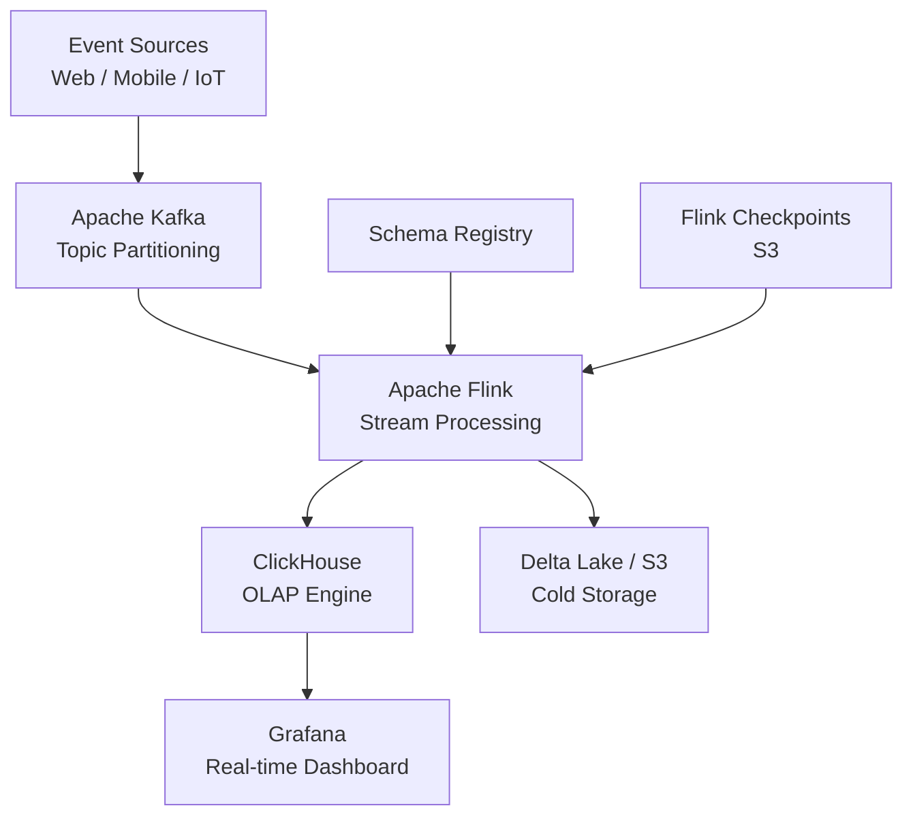

# Lakehouse OLAP Pipelines — Flink + ClickHouse


Real-time OLAP analytics pipeline that ingests high-throughput event streams via Apache Kafka, processes them with Apache Flink, and stores aggregated results in ClickHouse for sub-second analytical queries. Designed to handle **72,000+ events/hour** with end-to-end latency under 2 seconds.

## Architecture



## Features

- Real-time stream ingestion with Apache Kafka (multi-partition, fault-tolerant)
- Stateful stream processing with Apache Flink (windowed aggregations, exactly-once semantics)
- Sub-second OLAP queries on ClickHouse with MergeTree engine
- Delta Lake integration for historical data archiving
- Grafana dashboards for operational monitoring
- Dockerized end-to-end deployment

## Tech Stack

| Layer | Technology |
|-------|-----------|
| Ingestion | Apache Kafka 3.x |
| Processing | Apache Flink 1.17 |
| OLAP Store | ClickHouse 23.x |
| Cold Storage | Delta Lake on S3 |
| Orchestration | Docker Compose |
| Monitoring | Grafana + Prometheus |

## Prerequisites

- Docker & Docker Compose
- Java 11+
- Python 3.10+

## Quick Start

```bash
git clone https://github.com/zulham-tech/lakehouse-olap-pipelines-flink-clickhouse.git
cd lakehouse-olap-pipelines-flink-clickhouse
docker compose up -d
```

Access dashboards:
- Flink UI: http://localhost:8081
- ClickHouse: http://localhost:8123
- Grafana: http://localhost:3000

## Project Structure

```
.
├── flink_jobs/          # Flink DataStream & Table API jobs
├── kafka_producers/     # Event producers & schema definitions
├── clickhouse/          # DDL scripts & MergeTree schema
├── delta_lake/          # Delta Lake sink connectors
├── grafana/             # Dashboard JSON exports
├── docker-compose.yml
└── requirements.txt
```

## Author

**Ahmad Zulham** — [LinkedIn](https://linkedin.com/in/ahmad-zulham-665170279) | [GitHub](https://github.com/zulham-tech)
